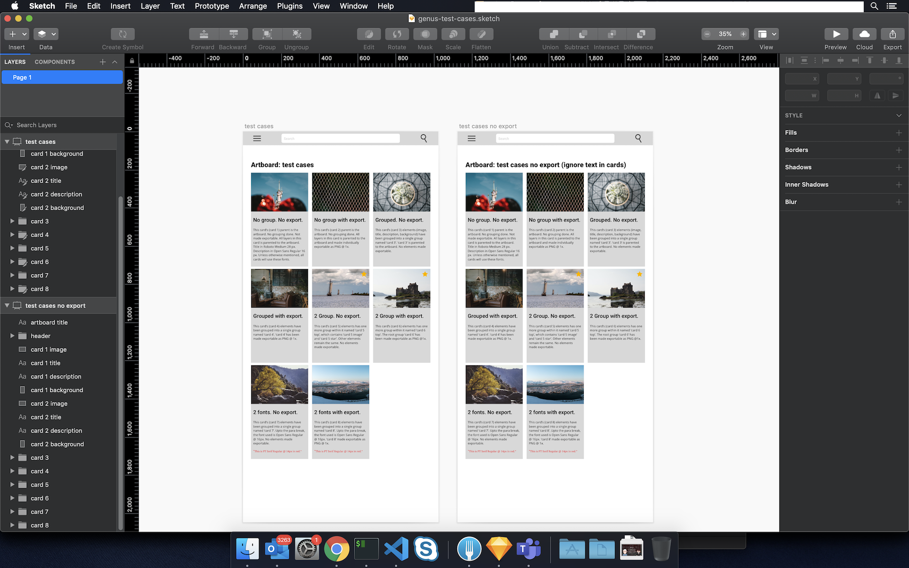
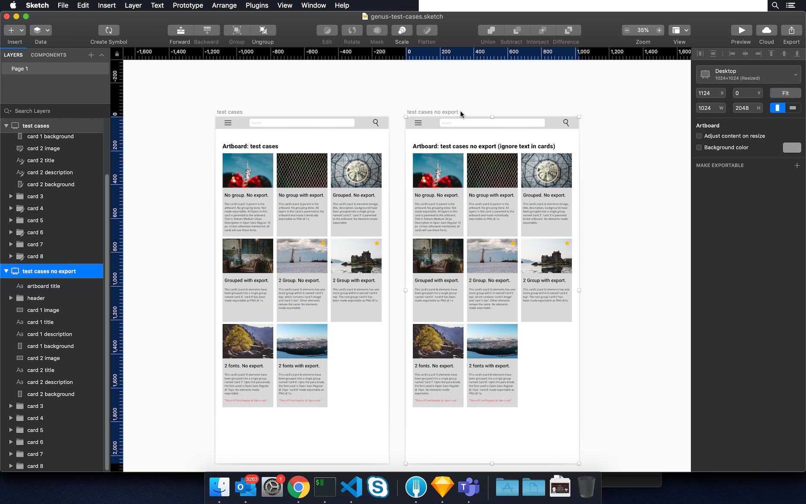
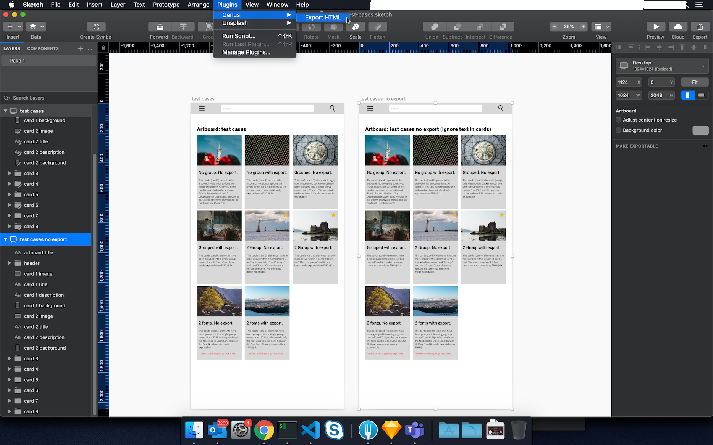
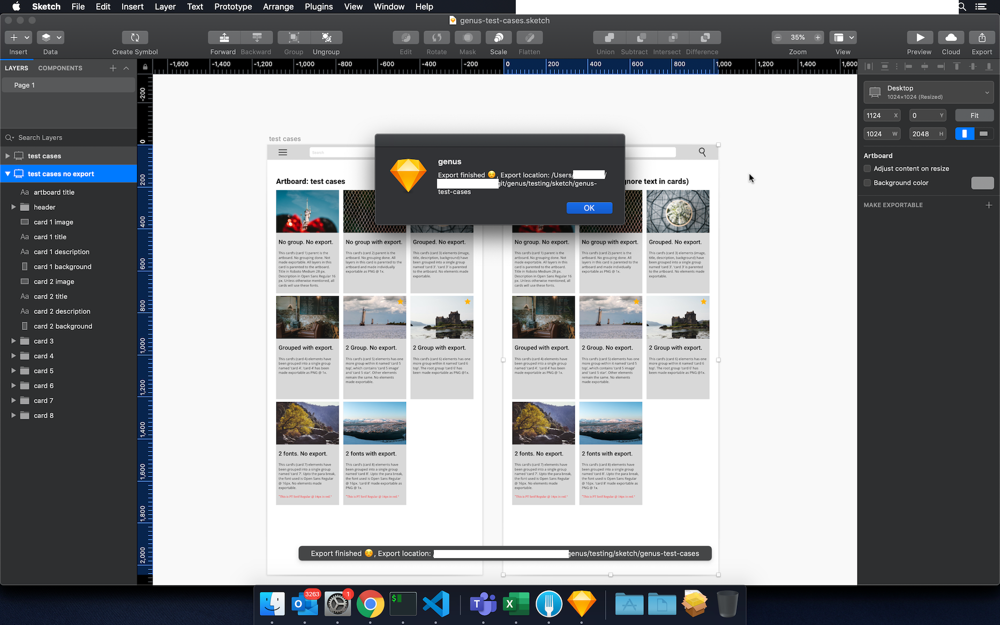
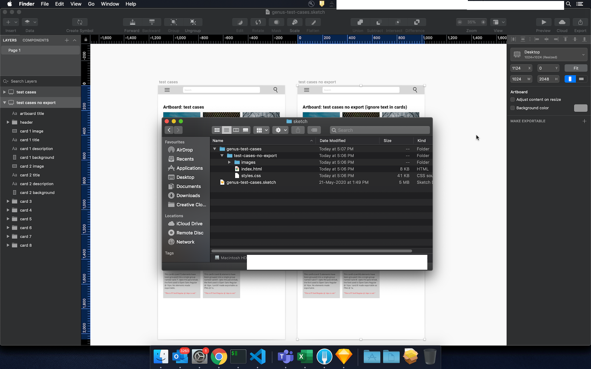
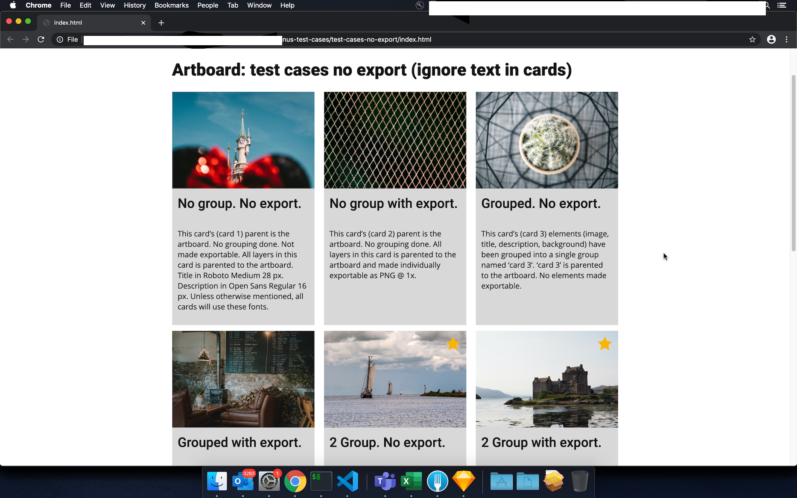

# Genus
## Description
A sketch plugin for exporting prototype website (static html css) from your sketch designs

## How to install Genus
1. Make sure you have Sketch installed in your Mac OS machine.
1. Click on [Genus Github zip download](https://github.com/keplerlab/genus/archive/master.zip) to get the compressed repo.
1. Unzip the downloaded file.
1. Double click on Genus.sketchplugin to install the plugin.


## User Guide
### How to export HTML using Genus plugin

1. Open your design made in Sketch (Alternatively, we have provided a test Sketch file in the zip file under testing>sketch>genus-test-cases.sketch).  
    
    

1. Select the artboard(s) you want to export as HTML.    
   
    

1. Go to the menu bar, Plugins>Genus>Export.   

    

1. After processing, the HTML and associated assets are exported to the same location as the Sketch file. The path is also mentioned in the dialog box.     

    

1. Once exported, you can go the exported location and you will find folder(s) named after the name of your artboards(s) selected for export.   

    

1. Open a folder and open index.html to see the result in your browser.     

    


### Tips for creating Sketch designs which can be helpful to create logical HTML output
1. Naming each layer logically can greatly help in inspecting the generated HTML and trace back problems.
1. Grouping logical entities can help you create nested divs.
1. If the intent is to export groups as png, make a group exportable.

## Troubleshooting/Known issues 
1. If there are any missing fonts notification which comes up on the top right of the Sketch application, please install them.
1. In case fonts are not rendered properly in the browser, you might want to import the fonts in CSS. This can be done by: 
    1. Adding Google fonts as per required like the following statement ```@import url('https://fonts.googleapis.com/css?family=Roboto:500,900|PT+Serif:400|Open+Sans:400');``` (this is for the fonts used in genus-test-cases.sketch sample file).
    1. Copying font files to a font folder and importing them can also make it work.
1. In some rare cases font weight rendered by html and sketch could be different. In those cases you might want to check correct font weight from sketch file and edit those values into generated css. 

## Development Guide

### Installation

> Important: [Node.js](https://nodejs.org/en/download/) > V6.x is a minimum requirement. You also need the [command line tools](http://osxdaily.com/2014/02/12/install-command-line-tools-mac-os-x/) installed.

_This plugin was created using `skpm`. For a detailed explanation on how things work, checkout the [skpm Readme](https://github.com/skpm/skpm/blob/master/README.md)._

### Usage

Install the dependencies

```bash
npm install
```

Once the installation is done, you can run some commands inside the project folder:

```bash
npm run build
```

The folder *.sketchplugin is the plugin bundle generated by the skpm build process. **DO NOT EDIT** any of the files within this folder, any changes will be overwritten with the next build.

To watch for changes:

```bash
npm run watch
```

Additionally, if you wish to run the plugin every time it is built:

```bash
npm run start
```

### Debugging

To view the output of your `console.log`, you have a few different options:

- Use the [`sketch-dev-tools`](https://github.com/skpm/sketch-dev-tools)
- Run `skpm log` in your Terminal, with the optional `-f` argument (`skpm log -f`) which causes `skpm log` to not stop when the end of logs is reached, but rather to wait for additional data to be appended to the input


### Attributions
1. HTML and CSS generation code for exporting images inspired from [SketchHTMLExport plugin by mludowise](https://github.com/mludowise/Sketch-HTML-Export )
1. Icon for plugin Image by [Nikin from Pixabay](https://pixabay.com/illustrations/html-icon-web-development-design-2188441/)